# Akuma Quiz

Projeto desenvolvido para a disciplina de Linguagem de Programação Orientada a Objetos.

O Akuma Quiz é um jogo de quiz com batalhas em turnos, inspirado na série Miraculous: As Aventuras de Ladybug. O jogador escolhe um herói, responde perguntas de diferentes dificuldades e enfrenta vilões ao longo de uma campanha dividida em fases. 

Cada resposta influencia diretamente a batalha: ao acertar, o jogador ataca o inimigo; ao errar ou deixar o tempo acabar em perguntas cronometradas, o vilão contra-ataca. O jogo também possui habilidades especiais, sistema de pontuação, checkpoints, estatísticas finais e progressão gradual de dificuldade.

A versão atual funciona por meio de interface textual no terminal. A implementação de uma interface gráfica foi considerada, mas ficou como possibilidade de melhoria pós-disciplina.

**Este projeto possui finalidade exclusivamente acadêmica e não tem fins comerciais.*

## Como executar

### Requisitos
Para executar o projeto, é necessário ter o Java instalado na máquina:
 - JDK 11 ou superior instalado.
 - Uma IDE compatível com Java, como VS Code, IntelliJ IDEA ou Eclipse.

### Passos para execução - IDE
- Baixe ou clone este repositório.
- Abra a pasta do projeto em uma IDE, como VS Code ou IntelliJ IDEA.
- Localize a classe principal: `jogoPOO/src/game/core/Game.java`
- Execute o método `main` da classe `Game`.


### Passos para execução - Terminal
Também é possível executar pelo terminal, compilando os arquivos Java a partir da pasta src:

```bash
cd jogoPOO/src
```

Compile a classe principal:

```bash
javac game/core/Game.java
```

Execute o jogo:

```bash
java game.core.Game
```

---

## Funcionalidades Implementadas
- Sistema de personagens baseado em herança e polimorfismo.
- Seleção de heróis jogáveis.
- Sistema de inimigos e vilões por fase.
- Sistema de fases progressivas.
- Sistema de batalhas por rodadas.
- Sistema de pontuação por fase e pontuação total.
- Banco de perguntas aleatórias distribuídas em três níveis: Fundamental 1, Fundamental 2 e Ensino Médio.
- Perguntas de múltipla escolha.
- Perguntas de múltiplas respostas.
- Perguntas de verdadeiro ou falso.
- Perguntas com tempo limite.
- Progressão de cronômetro por fase:
		- Fase 1: perguntas fáceis cronometradas.
		- Fase 2: perguntas médias cronometradas.
		- Fase 3: perguntas difíceis cronometradas.
		- Fase Final: todas as perguntas cronometradas.
- Habilidades especiais exclusivas para cada personagem.
- Sistema de tentativas/retry em caso de derrota (checkpoints).
- Estatísticas finais da partida.
- Tratamento de entradas inválidas.
- Exceções personalizadas.
- Interface textual via terminal.
---

## Estrutura do Projeto
O projeto está organizado em pacotes (`packages`) com responsabilidades bem definidas, buscando facilitar a manutenção, a expansão e a leitura do sistema.

### **`core`**

Contém as classes responsáveis pelo funcionamento principal do jogo.

- `Game` – ponto de entrada da aplicação, responsável pelo fluxo geral do jogo, contextualização inicial, criação do jogador, montagem das fases e exibição da tela final.
- `BattleManager` – coordena a batalha de uma fase específica.
- `Round` – controla a execução de uma rodada, incluindo pergunta, resposta, uso de habilidade e ataque.
- `ScoreSystem` – gerencia a pontuação por fase e a pontuação total.
- `Level` – representa uma fase do jogo, controlando vilão, perguntas, progressão de dificuldade, perguntas cronometradas e textos narrativos da fase.
- `GameStats` – registra estatísticas da partida, como acertos, erros, tentativas e fases concluídas.
- `ResultadoBatalha` – enumeração que representa os possíveis resultados de uma batalha.

### **`characters`**

Contém as classes relacionadas aos personagens do jogo.

- `Character` – classe abstrata que define atributos e comportamentos comuns aos personagens.
- `Ladybug` – personagem com habilidade de recuperação de vida.
- `CatNoir` – personagem ofensivo com dano dobrado temporário.
- `Carapace` – personagem defensivo com escudo protetor.
- `RenaRouge` – personagem estratégica capaz de revelar uma alternativa incorreta.
- `Viperion` – personagem que permite uma segunda tentativa de resposta.
- `Vesperia` – personagem que ignora temporariamente o limite de tempo de uma pergunta.
- `VilaoF1`, `VilaoF2`, `VilaoF3` e `VilaoBoss` – vilões enfrentados ao longo das fases.
- `Player` – representa o jogador, armazenando nome, pontuação e personagem escolhido.
- `Enemy` – representa o inimigo da fase.
- `CharacterFactory` – centraliza a criação dos personagens jogáveis a partir da escolha do usuário.

### **`questions`**

Responsável pelo sistema de perguntas e respostas.

- `Question` – classe abstrata base para todas as perguntas, incluindo suporte a tempo limite.
- `MultipleChoiceQuestion` – representa perguntas de múltipla escolha.
- `MultipleAnswerQuestion` – representa perguntas com mais de uma alternativa correta.
- `TrueFalseQuestion` – representa perguntas de verdadeiro ou falso.
- `QuestionBank` – armazena e fornece perguntas aleatórias, inclusive filtradas por dificuldade.

### **`abilities`**

Contém as habilidades especiais dos personagens.

- `Ability` – classe abstrata base para habilidades, com controle de limite de usos.
- `HealAbility` – recuperação parcial de vida (Ladybug).
- `DoubleDamageAbility` – faz o próximo ataque causar dano dobrado (Cat Noir).
- `ShieldAbility` – bloqueia um ataque recebido (Carapace).
- `HintAbility` – revela uma alternativa incorreta (Rena Rouge).
- `SecondChanceAbility` – permite responder novamente após um erro (Viperion).
- `TimeFreezeAbility` – ignora o limite de tempo de uma pergunta cronometrada (Vesperia).

### **`interfaces`**

Contém contratos utilizados por classes do sistema.

- `SpecialAbility` – define os métodos obrigatórios para habilidades especiais.
- `TimedQuestion` – define o comportamento relacionado a perguntas com tempo limite.

### **`exceptions`**

Contém exceções personalizadas do projeto.

- `EntradaInvalidaException` – utilizada para tratar entradas inválidas do usuário.
- `PerguntaIndisponivelException` – utilizada quando não há perguntas suficientes para montar as fases.

### **`utils`**

Contém classes auxiliares utilizadas por diferentes partes do sistema.

- `InputHandler` – centraliza a leitura, validação e organização das entradas fornecidas pelo usuário no terminal.

---

## Justificativas de Design
O projeto foi desenvolvido seguindo os princípios da Programação Orientada a Objetos, buscando modularidade, reutilização de código, separação de responsabilidades, encapsulamento e facilidade de manutenção.

A classe `Game` atua como ponto de entrada da aplicação, sendo responsável por inicializar os principais objetos do sistema, criar o jogador, montar as fases e controlar o fluxo geral da campanha.

A classe `Round` representa uma rodada individual da batalha, sendo responsável por exibir a pergunta, permitir o uso de habilidades, validar respostas e aplicar os efeitos do acerto ou erro.

O controle da pontuação foi separado na classe `ScoreSystem`, enquanto as estatísticas gerais da partida foram concentradas em `GameStats`. Essa separação torna o código mais organizado e facilita alterações futuras.

A classe `Level` organiza as perguntas em fases, controla a progressão de dificuldade, define quais perguntas terão limite de tempo e armazena os textos narrativos de cada etapa da campanha. Dessa forma, cada fase possui identidade própria, vilão específico, distribuição de perguntas e regras de cronômetro.

A classe `BattleManager` coordena a batalha de uma fase específica, interagindo com `Player`, `Enemy`, `Level`, `Round`, `ScoreSystem` e `GameStats`. Essa separação evita que toda a lógica do jogo fique concentrada em uma única classe.

Para representar os personagens, foi utilizada uma hierarquia baseada na classe abstrata `Character`, que concentra atributos e comportamentos comuns, como vida, ataque, defesa, habilidade, cálculo de dano, recebimento de dano e estados temporários. As classes dos heróis e dos vilões especializam essa estrutura, aproveitando herança e polimorfismo.

A criação dos personagens jogáveis foi centralizada na classe `CharacterFactory`, reduzindo o acoplamento entre a classe principal `Game` e as classes concretas dos personagens.

As habilidades foram modeladas a partir da classe abstrata `Ability`, que implementa a interface `SpecialAbility`. Essa estrutura define um contrato comum para todas as habilidades e permite que cada personagem tenha um comportamento especial próprio, mantendo o controle de usos e favorecendo a expansão futura.

O sistema de perguntas foi modelado a partir da classe abstrata `Question`, especializada pelas classes `MultipleChoiceQuestion`, `MultipleAnswerQuestion` e `TrueFalseQuestion`. A interface `TimedQuestion` define o comportamento relacionado ao tempo limite, enquanto a própria classe `Question` controla se uma pergunta está ou não cronometrada. Dessa forma, não foi necessário criar uma classe separada para cada tipo de pergunta temporizada.

A classe `QuestionBank` é responsável por armazenar as perguntas e fornecer questões aleatórias, inclusive por nível de dificuldade.

Para aumentar a robustez da aplicação, foram criadas exceções personalizadas, como `EntradaInvalidaException` e `PerguntaIndisponivelException`. A entrada de dados foi centralizada em `InputHandler`, evitando repetição de código e impedindo que o programa seja encerrado por entradas inválidas.

Essa organização favorece a clareza do código, facilita futuras extensões e demonstra a aplicação prática de conceitos como herança, abstração, polimorfismo, encapsulamento, interfaces, exceções e composição.

---

## Limitações e Melhorias Futuras

Devido ao tempo disponível para as entregas da disciplina, o projeto foi finalizado com interface textual via terminal.
Como melhorias futuras, podemos implementar:

- Interface gráfica.
- Novos personagens jogáveis.
- Novas habilidades especiais.
- Novos vilões/fases.
- Novos tipos de perguntas.
- Novos modos de jogo.
- Sistema de loja de personagens ou power-ups.
- Sistema de salvamento de progresso e Rankings.
- Balanceamento mais refinado de fases, dano e pontuação.
- etc.

---

## UML - Diagrama de classe
Organização visual da arquitetura do nosso projeto:

```mermaid
classDiagram

%% =====================================================
%% PACOTE CHARACTERS - PERSONAGENS
%% =====================================================
    class Character {
        <<abstract>>
        # nomePersonagem : String
        # hp : int
        # ataque : int
        # defesa : int
        # hpMaximo : int
        # habilidade : Ability
		# escudoAtivo : boolean
        # danoDobrado : boolean
        # segundaChanceAtiva : boolean
        # tempoCongelado : boolean
        # miragemAtiva : boolean
	   	+ estaVivo() boolean
		+ ativarEscudo() void
		+ ativarDanoDobrado() void
		+ ativarSegundaChance() void
		+ desativarSegundaChance() void
		+ ativarTempoCongelado() void
		+ desativarTempoCongelado() void
		+ ativarMiragem() void
		+ desativarMiragem() void
		+ recuperarVida(quantidade:int) void
		+ restaurarEstado() void
		+ atacar(alvo:Character) void
		+ calcularDano(dificuldade:int) int
		+ receberDano(dano:int) int
    }

    class Ladybug
    class CatNoir
    class Carapace
    class RenaRouge
    class Viperion
    class Vesperia
	class VilaoF1
	class VilaoF2
	class VilaoF3
    class VilaoBoss

    Character <|-- Ladybug
    Character <|-- CatNoir
    Character <|-- Carapace
    Character <|-- RenaRouge
    Character <|-- Viperion
    Character <|-- Vesperia
	Character <|-- VilaoF1
	Character <|-- VilaoF2
	Character <|-- VilaoF3
    Character <|-- VilaoBoss

    class Player {
        - nomeUsuario : String
        - pontuacao : int
		- personagemSelecionado : Character
        + adicionarPontuacao() void
		+ getNomeUsuario() String
    	+ getPontuacao() int
    	+ getPersonagemSelecionado() Character
    }

    class Enemy {
    - personagemInimigo : Character
    }

	class CharacterFactory {
    + criar(escolha:int) Character
	}

Player --> Character : escolhe
Enemy --> Character : usa
Character --> Ability : possui
CharacterFactory ..> Character : cria

%% =====================================================
%% PACOTE ABILITIES - HABILIDADES
%% =====================================================
    class Ability {
        <<abstract>>
        # nome : String
        # limiteUsos : int
        # usosAtuais : int
		+ podeUsar() boolean
	    + consumirUso() void
	    + resetarUsos() void
    	+ ativar(heroi:Player, akumatizado:Enemy) void
    }

    class HealAbility
    class DoubleDamageAbility
    class ShieldAbility
    class HintAbility
    class SecondChanceAbility
    class TimeFreezeAbility

    Ability <|-- HealAbility
    Ability <|-- DoubleDamageAbility
    Ability <|-- ShieldAbility
    Ability <|-- HintAbility
    Ability <|-- SecondChanceAbility
    Ability <|-- TimeFreezeAbility

Ability ..|> SpecialAbility

%% =====================================================
%% PACOTE QUESTIONS - PERGUNTAS
%% =====================================================
    class Question {
        <<abstract>>
        # enunciado : String
        # respostaCerta : String
        # dificuldade : int
		# possuiTempo : boolean
   	 	# tempoLimite : int
    	+ ativarTempo() void
		+ validarResposta(respostaJogador:String) void
    	+ verificarResposta(respostaJogador:String) boolean
   		+ exibirPergunta() void
   		+ obterAlternativaErrada() String
		+ tempoEsgotado(tempoInicio:long) boolean
    	+ exibirAlternativas() void
    }

    class MultipleChoiceQuestion {
        - alternativas : String[]
    }

    class MultipleAnswerQuestion {
        - alternativas : String[]
    }

    class TrueFalseQuestion

    Question <|-- MultipleChoiceQuestion
    Question <|-- MultipleAnswerQuestion
    Question <|-- TrueFalseQuestion

	Question ..|> TimedQuestion

    class QuestionBank {
        - perguntas : ArrayList<Question>
		- carregarPerguntas() void
        + getPerguntaAleatoria() Question
		+ getPerguntaAleatoriaPorDificuldade(dificuldade:int) Question
    }

    QuestionBank "1" o-- "*" Question : armazena

%% =====================================================
%% PACOTE CORE - FLUXO PRINCIPAL
%% =====================================================
    class Game {
		+ main() void
		- jogarFaseComRetry(jogador:Player, fase:Level, input:InputHandler, score:ScoreSystem, stats:GameStats) void
    	- carregarPerguntas(fase:Level, banco:QuestionBank, faceis:int, medias:int, dificeis:int) void
    	- exibirTelaFinal(jogador:Player, score:ScoreSystem, stats:GameStats, input:InputHandler) void
    }
    
    class BattleManager {
		- jogador : Player
		- fase : Level
   		- vilao : Enemy
   		- score : ScoreSystem
   		- rodada : Round
		- stats : GameStats
        + iniciarBatalha() ResultadoBatalha
    }

    class Round {
		- input : InputHandler
        + jogarRodada(jogador:Player, inimigo:Enemy, pergunta:Question) boolean
		- lerRespostaValida(mensagem:String, pergunta:Question) String
    }

	class Level {
	    - nomeFase : String
	    - vilao : Enemy
	    - dificuldadeCronometrada : int
	    - todasCronometradas : boolean
		- contexto : String
	    - fraseMotivacional : String
	    - fraseVitoria : String
	    - fraseDerrota : String
		- todasFaceis : List
	    - todasMedias : List
	    - todasDificeis : List
	    - faceis : List
	    - medias : List
	    - dificeis : List
		- faceisUsadas : int
	    - mediasUsadas : int
	    - dificeisUsadas : int
		- configurarNarrativa(nomeFase:String) void
		+ reset() void
		- prepararPergunta(pergunta:Question) Question
	    + adicionarPergunta(pergunta:Question) void
		- selecionarPorRegra(maxFaceis:int, maxMedias:int, maxDificeis:int) Question
	    + getProximaPergunta() Question
	    
	}

    class ScoreSystem {
        - pontuacaoFase : int
	    - pontuacaoTotal : int
	    + iniciarNovaFase() void
	    + adicionarPontosFase(pontos:int) void
	    + adicionarPontosTotal() void
    }

	class GameStats {
	    - fasesConcluidas : int
	    - tentativas : int
	    - perguntasRespondidas : int
	    - acertos : int
	    - erros : int
	    + registrarTentativa() void
	    + registrarFaseConcluida() void
	    + registrarResposta(acertou:boolean) void
	    + calcularTaxaAcerto() double
	}

	class ResultadoBatalha {
	    <<enumeration>>
	    VITORIA
	    DERROTA_JOGADOR
	    DERROTA_LIMITE_PERGUNTAS
	}

	Game --> Player : cria
	Game --> CharacterFactory : usa
	Game --> QuestionBank : monta fases
	Game --> Level : executa
	Game --> ScoreSystem : usa
	Game --> GameStats : usa
	Game --> BattleManager : inicia
	
	BattleManager --> Player : controla
	BattleManager --> Level : usa
	BattleManager --> Enemy : enfrenta
	BattleManager --> Round : executa
	BattleManager --> ScoreSystem : atualiza
	BattleManager --> GameStats : registra
	BattleManager --> ResultadoBatalha : retorna
	
	Level --> Enemy : possui
	Level "1" o-- "*" Question : organiza
	Round --> Player : usa
	Round --> Enemy : usa
	Round --> Question : apresenta
	Round ..> TimedQuestion : verifica tempo

%% =====================================================
%% PACOTE UTILS
%% =====================================================
    class InputHandler {
	- scanner : Scanner
	+ lerString(mensagem:String) String
	+ lerInteiro(mensagem:String, min:int, max:int) int
	+ esperarEnter() void
	+ imprimirLinha() void
	+ fechar() void
    }


BattleManager ..> InputHandler
Round ..> InputHandler
Game ..> InputHandler

%% =====================================================
%% PACOTE EXCEPTIONS
%% =====================================================
class EntradaInvalidaException
class PerguntaIndisponivelException

InputHandler ..> EntradaInvalidaException : trata
Question ..> EntradaInvalidaException : valida
QuestionBank ..> PerguntaIndisponivelException : lança
Game ..> PerguntaIndisponivelException : trata

%% =====================================================
%% PACOTE INTERFACES
%% =====================================================
    class SpecialAbility {
		<<Interface>>
	    + getNome() String
	    + podeUsar() boolean
	    + consumirUso() void
	    + ativar(heroi:Player, akumatizado:Enemy) void
	}

    class TimedQuestion {
		<<Interface>>
	    + getTempoLimite() int
	    + tempoEsgotado(tempoInicio:long) boolean
    }
```


