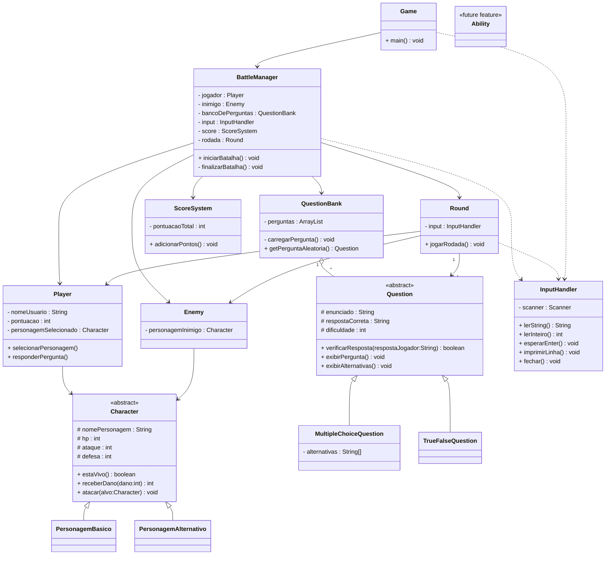

# Jogo-LPOO-nomeProvisorio-

(README em andamento)

*Descrição do jogo será adicionada depois de definirmos o tema e as mecânicas finais*

## Como executar

## Funcionalidades Implementadas

- Sistema de personagens baseado em herança.
- Sistema de perguntas de múltipla escolha.
- Sistema de perguntas verdadeiro ou falso.
- Seleção de personagem.
- Sistema de batalhas por rodadas.
- Controle de pontuação.
- Banco de perguntas.
- Interface textual via terminal.

## Estrutura do Projeto
O projeto está organizado em pacotes (packages) com responsabilidades bem definidas, buscando facilitar a manutenção e a expansão do sistema.

### **`core`**

Contém as classes responsáveis pelo funcionamento principal do jogo.

- `Game` – ponto de entrada da aplicação (`Main`).
- `BattleManager` – coordena o fluxo das batalhas.
- `Round` – controla a execução de uma rodada.
- `ScoreSystem` – gerencia a pontuação do jogador.

### **`characters`**

Contém as classes relacionadas aos personagens.

- `Character` – classe abstrata que define atributos e comportamentos comuns.
- `PersonagemBasico` – implementação básica de personagem.
- `PersonagemAlternativo` – implementação alternativa de personagem.
- `Player` – representa o jogador.
- `Enemy` – representa o oponente.

### **`questions`**

Responsável pelo sistema de perguntas e respostas.

- `Question` – classe abstrata base para todas as perguntas.
- `MultipleChoiceQuestion` – perguntas de múltipla escolha.
- `TrueFalseQuestion` – perguntas de verdadeiro ou falso.
- `QuestionBank` – armazena e fornece perguntas durante o jogo.

### **`utils`**

Contém classes utilitárias utilizadas por diferentes partes do sistema.

- `InputHandler` – centraliza a leitura de dados fornecidos pelo usuário.

### **`abilities`**

Pacote reservado para futuras habilidades e mecânicas especiais dos personagens.

## Justificativas de Design
O projeto foi desenvolvido seguindo os princípios da Programação Orientada a Objetos, buscando modularidade, reutilização de código e facilidade de manutenção.

A classe `BattleManager` atua como controlador principal da aplicação, sendo responsável por coordenar o fluxo da batalha e a interação entre os demais componentes do sistema.

Para representar os personagens do jogo foi utilizada uma hierarquia de herança baseada na classe abstrata `Character`, que concentra atributos e comportamentos comuns. Dessa forma, diferentes tipos de personagens podem ser implementados sem duplicação de código.

O sistema de perguntas foi modelado a partir da classe abstrata `Question`, especializada pelas classes `MultipleChoiceQuestion` e `TrueFalseQuestion`. Essa abordagem utiliza polimorfismo e facilita a inclusão de novos tipos de perguntas futuramente.

O gerenciamento das questões é realizado pela classe `QuestionBank`, responsável por armazenar e disponibilizar perguntas durante a execução do jogo.

As classes `Player` e `Enemy` encapsulam as informações dos participantes da batalha, enquanto `ScoreSystem` centraliza o controle da pontuação.

Para evitar repetição de código relacionada à entrada de dados, foi criada a classe utilitária `InputHandler`, responsável pela comunicação entre o sistema e o usuário.

Essa organização favorece a separação de responsabilidades entre as classes, melhora a legibilidade do código e facilita futuras extensões do projeto.

## UML - Diagrama de classe
Organização visual da arquitetura do nosso projeto:

